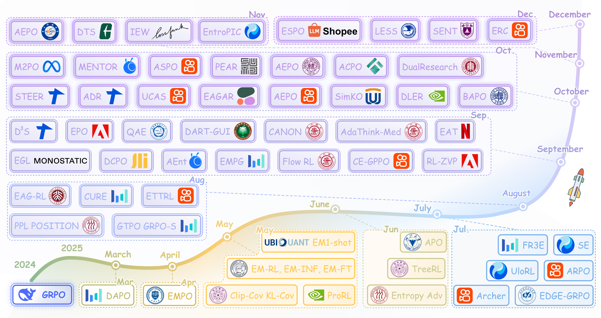

# Entropy Mechanism in Large Reasoning Models: A Survey

[](link-to-paper)

This repository contains a curated list of papers on entropy mechanisms in Large
Reasoning Models (LRMs), covering both training and inference techniques.


*Figure 2: Timeline of papers on entropy mechanisms in LRM within one year after the emergence of GRPO.*

## 📋 Table of Contents

- [Training Methods](#training-methods)
  - [Sampling](#sampling)
  - [Advantage](#advantage)
  - [Clip](#clip)
  - [KL Penalty](#kl-penalty)
  - [Optimization](#optimization)
- [Inference Methods](#inference-methods)
  - [Entropy‑Guided](#entropy‑guided)
  - [Self‑Consistency](#self‑consistency)

---

## Training Methods

### Sampling

Methods that control which queries and trajectories are sampled during training.

| Paper | Institution | PDF | Code |
|-------|-------------|-----|------|
| **TreeRL: LLM Reinforcement Learning with On‑Policy Tree Search** | **Tsinghua University** | [arXiv](https://arxiv.org/pdf/2506.11902) | [GitHub](https://github.com/THUDM/TreeRL) |
| **First Return, Entropy‑Eliciting Explore** | **ByteDance** | [arXiv](https://arxiv.org/pdf/2507.07017) | [HuggingFace](https://huggingface.co/FR3E-Bytedance) |
| **ETTRL: Balancing Exploration and Exploitation in LLM Test‑Time RL** | **Kuaishou Technology** | [arXiv](https://arxiv.org/pdf/2508.11356) | – |
| **Adaptive Dual Reasoner: Large Reasoning Models Can Think Efficiently by Hybrid Reasoning** | **Tencent Youtu Lab** | [arXiv](https://arxiv.org/pdf/2510.10207) | – |
| **CURE: Critical‑Token‑Guided Re‑Concatenation for Entropy‑Collapse Prevention** | **ByteDance** | [arXiv](https://arxiv.org/pdf/2508.11016) | [GitHub](https://github.com/bytedance/CURE) |
| **Agentic Reinforced Policy Optimization** | **Kuaishou Technology** | [arXiv](https://arxiv.org/pdf/2507.19849) | [GitHub](https://github.com/dongguanting/ARPO) |
| **Agentic Entropy-Balanced Policy Optimization** | **Kuaishou Technology** | [arXiv](https://arxiv.org/pdf/2510.14545) | [GitHub](https://github.com/dongguanting/ARPO) |
| **Arbitrary Entropy Policy Optimization: Entropy Is Controllable in Reinforcement Fine‑Tuning** | **Nankai University** | [arXiv](https://arxiv.org/pdf/2510.08141) | [GitHub](https://github.com/597358816/AEPO) |


### Advantage

Methods that modify advantage calculations through entropy bonuses or coefficients.

| Paper | Institution | PDF | Code |
|-------|-------------|-----|------|
| **Reasoning with Exploration: An Entropy Perspective on RL for LLMs** | **Microsoft Research Asia** | [arXiv](https://arxiv.org/pdf/2506.14758) | – |
| **No Prompt Left Behind: Exploiting Zero‑Variance Prompts in LLM RL via Entropy‑Guided Advantage Shaping** | **Adobe Research** | [arXiv](https://arxiv.org/pdf/2509.21880) | – |
| **Right Question is Already Half the Answer: Fully Unsupervised LLM Reasoning Incentivization** | **Tencent AI Lab** | [arXiv](https://arxiv.org/pdf/2504.05812) | [GitHub](https://github.com/QingyangZhang/EMPO) |
| **Decomposing the Entropy‑Performance Exchange: The Missing Keys to Unlocking Effective RL** | **Renmin University of China** | [arXiv](https://arxiv.org/pdf/2508.02260) | – |
| **PEAR: Phase Entropy Aware Reward for Efficient Reasoning** | **Singapore University of Technology and Design** | [arXiv](https://arxiv.org/pdf/2510.08026) | [GitHub](https://github.com/iNLP-Lab/PEAR) |
| **Harnessing Uncertainty: Entropy‑Modulated Policy Gradients for Long‑Horizon LLM Agents** | **ByteDance** | [arXiv](https://arxiv.org/pdf/2509.09265) | – |
| **The Unreasonable Effectiveness of Entropy Minimization in LLM Reasoning** | **University of Illinois at Urbana‑Champaign** | [arXiv](https://arxiv.org/pdf/2505.15134) | [GitHub](https://github.com/shivamag125/EM_PT) |
| **SEED‑GRPO: Semantic Entropy Enhanced GRPO for Uncertainty‑Aware Policy Optimization** | **Zhejiang University** | [arXiv](https://arxiv.org/pdf/2505.12346) | – |
| **EDGE‑GRPO: Entropy‑Driven GRPO with Guided Error Correction for Advantage Diversity** | **Beihang University** | [arXiv](https://arxiv.org/pdf/2507.21848) | [GitHub](https://github.com/ZhangXJ199/EDGE-GRPO) |
| **Unlocking Exploration in RLVR: Uncertainty‑Aware Advantage Shaping for Deeper Reasoning** | **Kuaishou Technology** | [arXiv](https://arxiv.org/pdf/2510.10649) | [GitHub](https://github.com/xvolcano02/UCAS) |
| **Pinpointing Crucial Steps: Attribution‑Based Credit Assignment for Verifiable RL** | **Taikang Insurance Group Inc.** | [arXiv](https://arxiv.org/pdf/2510.08899) | – |
| **Conditional Advantage Estimation for RL in Large Reasoning Models** | **Shanghai Jiao Tong University** | [arXiv](https://arxiv.org/pdf/2509.23962) | [GitHub](https://github.com/biuboomc/CANON) |
| **Quantile Advantage Estimation for Entropy‑Safe Reasoning** | **University of Science and Technology of China** | [arXiv](https://arxiv.org/pdf/2509.22611) | [GitHub](https://github.com/junkangwu/QAE) |
| **AdaThink‑Med: Medical Adaptive Thinking with Uncertainty‑Guided Length Calibration** | **Shanghai Jiao Tong University** | [arXiv](https://arxiv.org/pdf/2509.24560) | [GitHub](https://github.com/shaohao011/AdaThinkMed) |
| **Beyond High-Entropy Exploration: Correctness-Aware Low-Entropy Segment-Based Advantage Shaping for Reasoning LLMs** | **Beijing University of Posts and Telecommunications** | [arXiv](https://arxiv.org/pdf/2512.00908) | - |

### Clip

Methods that adjust clipping mechanisms to control policy updates.

| Paper | Institution | PDF | Code |
|-------|-------------|-----|------|
| **DAPO: An Open‑Source LLM RL System at Scale** | **ByteDance** | [arXiv](https://arxiv.org/pdf/2503.14476) | [GitHub](https://github.com/BytedTsinghua-SIA/DAPO) |
| **DLER: Doing Length pEnalty Right – Incentivizing More Intelligence per Token via RL** | **NVIDIA** | [arXiv](https://arxiv.org/pdf/2510.15110) | [GitHub](https://github.com/NVlabs/DLER) |
| **Toward Better EHR Reasoning in LLMs: RL with Expert Attention Guidance** | **Peking University** | [arXiv](https://arxiv.org/pdf/2508.13579) | [GitHub](https://github.com/devilran6/EAG-RL) |
| **Clip‑Low Increases Entropy and Clip‑High Decreases Entropy in RL of Large Language Models** | **University of California, Los Angeles** | [arXiv](https://arxiv.org/pdf/2509.26114) | – |
| **BAPO: Stabilizing Off-Policy Reinforcement Learning for LLMs via Balanced Policy Optimization with Adaptive Clipping** | **Fudan University** | [arXiv](https://arxiv.org/pdf/2510.18927) | [GitHub](https://github.com/WooooDyy/BAPO)  |
| **Agentic Entropy‑Balanced Policy Optimization** | **Kuaishou Technology** | [arXiv](https://arxiv.org/pdf/2510.14545) | [GitHub](https://github.com/dongguanting/ARPO) |
| **Stabilizing Knowledge, Promoting Reasoning: Dual‑Token Constraints for RLVR** | **Kuaishou Technology** | [arXiv](https://arxiv.org/pdf/2507.15778) | [GitHub](https://github.com/wizard-III/ArcherCodeR) |
| **DCPO: Dynamic Clipping Policy Optimization** | **Baichuan.inc** | [arXiv](https://arxiv.org/pdf/2509.02333) | [GitHub](https://github.com/lime-RL/DCPO) |
| **ASPO: Asymmetric Importance Sampling Policy Optimization** | **Kuaishou Technology** | [arXiv](https://arxiv.org/pdf/2510.06062) | [GitHub](https://github.com/wizard-III/Archer2.0) |
| **CE‑GPPO: Controlling Entropy via Gradient‑Preserving Clipping Policy Optimization in RL** | **Kuaishou Technology** | [arXiv](https://arxiv.org/pdf/2509.20712) | – |
| **The Entropy Mechanism of RL for Reasoning Language Models** | **Shanghai AI Laboratory** | [arXiv](https://arxiv.org/pdf/2505.22617) | [GitHub](https://github.com/PRIME-RL/Entropy-Mechanism-of-RL) |
| **Prosperity before Collapse: How Far Can Off‑Policy RL Reach with Stale Data on LLMs?** | **Meta AI** | [arXiv](https://arxiv.org/pdf/2510.01161) | [GitHub](https://github.com/Infini-AI-Lab/M2PO) |
| **ESPO: Entropy Importance Sampling Policy Optimization** | **Meta AI** | [arXiv](https://www.arxiv.org/pdf/2512.00499) | - |
| **Entropy Ratio Clipping as a Soft Global Constraint for Stable Reinforcement Learning** | **Kuaishou Technology** | [arXiv](https://arxiv.org/pdf/2512.05591) | - |

### KL Penalty

Methods that adjust KL divergence constraints to regulate exploration.

| Paper | Institution | PDF | Code |
|-------|-------------|-----|------|
| **Open-reasoner-zero: An open source approach to scaling up reinforcement learning on the base model** | **StepFun** | [arXiv](https://arxiv.org/pdf/2503.24290) | [GitHub](https://github.com/Open-Reasoner-Zero/Open-Reasoner-Zero) |
| **DAPO: An Open‑Source LLM RL System at Scale** | **ByteDance** | [arXiv](https://arxiv.org/pdf/2503.14476) | [GitHub](https://github.com/BytedTsinghua-SIA/DAPO) |
| **Agentic Entropy‑Balanced Policy Optimization** | **Kuaishou Technology** | [arXiv](https://arxiv.org/pdf/2510.14545) | [GitHub](https://github.com/dongguanting/ARPO) |
| **ASPO: Asymmetric Importance Sampling Policy Optimization** | **Kuaishou Technology** | [arXiv](https://arxiv.org/pdf/2510.06062) | [GitHub](https://github.com/wizard-III/Archer2.0) |
| **ProRL: Prolonged RL Expands Reasoning Boundaries** | **NVIDIA** | [arXiv](https://arxiv.org/pdf/2505.24864) | – |
| **The Entropy Mechanism of RL for Reasoning Language Models** | **Shanghai AI Laboratory** | [arXiv](https://arxiv.org/pdf/2505.22617) | [GitHub](https://github.com/PRIME-RL/Entropy-Mechanism-of-RL) |
| **APO: Enhancing Reasoning Ability of MLLMs via Asymmetric Policy Optimization** | **Zhejiang University** | [arXiv](https://arxiv.org/pdf/2506.21655) | [GitHub](https://github.com/Indolent-Kawhi/View-R1) |
| **Stabilizing Knowledge, Promoting Reasoning: Dual‑Token Constraints for RLVR** | **Kuaishou Technology** | [arXiv](https://arxiv.org/pdf/2507.15778) | [GitHub](https://github.com/wizard-III/ArcherCodeR) |
| **RAGEN: Understanding Self-Evolution in LLM Agents via Multi-Turn Reinforcement Learning** | **Northwestern University** | [arXiv](https://arxiv.org/pdf/2507.14843) | [GitHub](https://github.com/mll-lab-nu/RAGEN) |
| **Efficient Reinforcement Learning with Semantic and Token Entropy for LLM Reasoning** | **Nanjing University** | [arXiv](https://arxiv.org/pdf/2512.04359) | - |


### Optimization

Methods that modify the optimization objective or re‑weight losses.

| Paper | Institution | PDF | Code |
|-------|-------------|-----|------|
| **Evolving Language Models without Labels: Majority Drives Selection, Novelty Promotes Variation** | **Tencent AI Lab** | [arXiv](https://arxiv.org/pdf/2509.15194) | – |
| **Rediscovering Entropy Regularization: Adaptive Coefficient Unlocks Its Potential for LLM RL** | **StepFun Inc.** | [arXiv](https://arxiv.org/pdf/2510.10959) | – |
| **On Entropy Control in LLM‑RL Algorithms** | **Ant Group** | [arXiv](https://arxiv.org/pdf/2509.03493) | – |
| **What Makes Reasoning Invalid: Echo Reflection Mitigation for LLMs** | **Salesforce AI Research** | [arXiv](https://arxiv.org/pdf/2511.06380) | – |
| **EPO: Entropy‑Regularized Policy Optimization for LLM Agents RL** | **Adobe** | [arXiv](https://arxiv.org/pdf/2509.22576) | [GitHub](https://github.com/WujiangXu/EPO) |
| **One‑shot Entropy Minimization** | **Ubiquant** | [arXiv](https://arxiv.org/pdf/2505.20282) | [GitHub](https://github.com/zitian-gao/one-shot-em) |
| **FlowRL: Matching Reward Distributions for LLM Reasoning** | **Shanghai AI Laboratory** | [arXiv](https://arxiv.org/pdf/2509.15207) | – |
| **Beyond the 80/20 Rule: High‑Entropy Minority Tokens Drive Effective RL for LLM Reasoning** | **Alibaba Inc.** | [arXiv](https://arxiv.org/pdf/2506.01939) | – |
| **Efficient Multi‑Turn RL for GUI Agents via Decoupled Training and Adaptive Data Curation** | **DataCanvas** | [arXiv](https://arxiv.org/pdf/2509.23866) | – |
| **Learning More with Less: A Dynamic Dual‑Level Down‑Sampling Framework for Efficient Policy Optimization** | **WeChat (Tencent)** | [arXiv](https://arxiv.org/pdf/2509.22115) | – |
| **UloRL: An Ultra‑Long Output RL Approach for Advancing LLM Reasoning Abilities** | **Tencent Hunyuan Team** | [arXiv](https://arxiv.org/pdf/2507.19766) | [GitHub](https://github.com/liushulinle/ULORL) |
| **Revisiting Entropy in Reinforcement Learning for Large Reasoning Models** | **Tianjin University** | [arXiv](https://arxiv.org/pdf/2511.05993) | - |
| **SIMKO: Simple Pass@K Policy Optimization** | **Westlake University** | [arXiv](https://arxiv.org/pdf/2510.14807) | [GitHub](https://github.com/CLR-Lab/SimKO) |
| **The Entropy Mechanism of RL for Reasoning Language Models** | **Shanghai AI Laboratory** | [arXiv](https://arxiv.org/pdf/2505.22617) | [GitHub](https://github.com/PRIME-RL/Entropy-Mechanism-of-RL) |
| **Rethinking Entropy Interventions in RLVR: An Entropy Change Perspective** | **Tencent** | [arXiv](https://arxiv.org/pdf/2510.10150) | [GitHub](https://github.com/zz-haooo/STEER) |
| **EntroPIC: Towards Stable Long-Term Training of LLMs via Entropy Stabilization with Proportional-Integral Control** | **Tencent** | [arXiv](https://arxiv.org/pdf/2511.15248) | [GitHub](https://github.com/yk7333/EntroPIC) |
---

## Inference Methods

### Entropy‑Guided

Methods that use entropy to guide inference decisions and control reasoning processes.

| Paper | Institution | PDF | Code |
|-------|-------------|-----|------|
| **Detecting Hallucinations in Large Language Models Using Semantic Entropy** | **University of Oxford** | [Nature](https://arxiv.org/pdf/2405.19648) | – |
| **Trace Length Is a Simple Uncertainty Signal in Reasoning Models** | **Apple** | [arXiv](https://arxiv.org/pdf/2510.10409) | – |
| **Entropy‑Guided Loop: Achieving Reasoning through Uncertainty‑Aware Generation** | **Monostate** | [arXiv](https://arxiv.org/pdf/2509.00079) | [GitHub](https://github.com/andrewmonostate/paper-entropy-loop) |
| **EAT: Entropy After `<Think>` for Reasoning Model Early Exiting** | **Netflix Research** | [arXiv](https://arxiv.org/pdf/2509.26522) | [GitHub](https://github.com/xidulu/EAT) |
| **DTS: Enhancing Large Reasoning Models via Decoding Tree Sketching** | **Johns Hopkins University** | [arXiv](https://arxiv.org/pdf/2511.00640) | [GitHub](https://github.com/ZichengXu/Decoding-Tree-Sketching) |
| **EAGER: Entropy‑Aware Generation for Adaptive Inference‑Time Scaling** | **Cohere** | [arXiv](https://arxiv.org/pdf/2510.11170) | [GitHub](https://github.com/DanielSc4/EAGer) |
| **Adaptive Termination for Multi‑Round Parallel Reasoning: A Universal Semantic Entropy‑Guided Framework** | **Tencent Hunyuan T1 Team** | [arXiv](https://arxiv.org/pdf/2507.06829) | – |

### Self‑Consistency

Methods that leverage entropy for answer aggregation and consistency enhancement.

| Paper | Institution | PDF | Code |
|-------|-------------|-----|------|
| **Selective Expert Guidance for Effective and Diverse Exploration in RL of LLMs** | **Ant Group** | [arXiv](https://arxiv.org/pdf/2510.04140) | [GitHub](https://github.com/Jiangzs1028/MENTOR) |
| **DualResearch: Entropy‑Gated Dual‑Graph Retrieval for Answer Reconstruction** | **Shanghai Artificial Intelligence Laboratory** | [arXiv](https://arxiv.org/pdf/2510.08959) | – |
| **The Sequential Edge: Inverse‑Entropy Voting Beats Parallel Self‑Consistency at Matched Compute** | **Lossfunk** | [arXiv](https://arxiv.org/pdf/2511.02309) | – |

---

## Citation

If you find this repository useful, please consider citing:

```bibtex
@article{entropy_lrm_survey2025,
  title={A Survey about Entropy Mechanism in Large Reasoning Models},
  author={Anonymous},
  journal={arXiv preprint arXiv:XXXX.XXXXX},
  year={2025}
}
